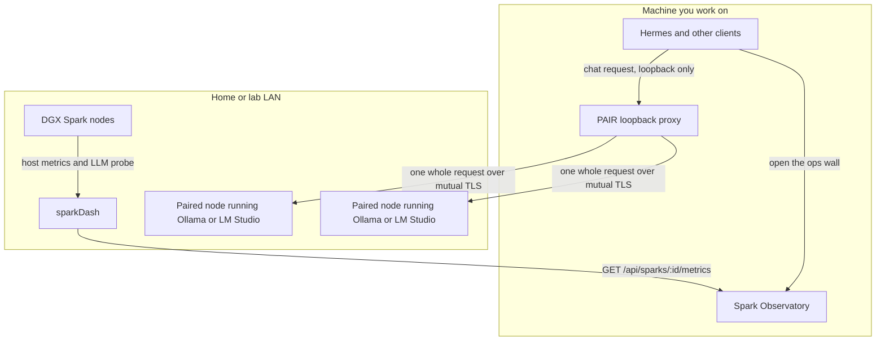

# Local mesh

A home or lab mesh here is three separate pieces on the same LAN. They do not share a process, a config file, or an author.

| Piece | Who owns it | What it is for |
|---|---|---|
| [NVIDIA Personal AI Router (PAIR)](https://github.com/NVIDIA/Personal-AI-Router) | NVIDIA. Apache-2.0. | Routes independent Ollama and LM Studio requests across paired machines. |
| [sparkDash](https://github.com/MiaAI-Lab/sparkDash) | MiaAI Lab. | Fleet metrics for DGX Spark (GB10) nodes. |
| This observatory | SMF Works. MIT. | Live ops wall that **reads** sparkDash. Hermes can open it. |

[smfworks/Personal-AI-Router](https://github.com/smfworks/Personal-AI-Router) is an SMF fork of NVIDIA's repository, kept for reference. It is not the install source, not the release source, and not an SMF product. SMF did not author PAIR. Installers, release notes, and behavior changes come from [NVIDIA/Personal-AI-Router](https://github.com/NVIDIA/Personal-AI-Router) and the [NVIDIA PAIR docs](https://docs.nvidia.com/local-ai/nvpair).

## How a request and a metric take different paths

PAIR and the observatory sit next to each other. An inference call never passes through this wall, and a temperature sample never passes through PAIR.

On the machine where you work, Hermes (or any other client) sends ordinary Ollama-compatible or OpenAI-compatible HTTP to PAIR's local proxy. PAIR picks one paired node that is reachable, running a compatible engine, and advertising the requested model, then forwards the **whole** request. That node's engine runs it. The reply streams back through the proxy. NVIDIA's overview: applications reach the proxy over loopback, and traffic between paired nodes uses mutual TLS limited to cluster members.

Separately, sparkDash polls the Spark fleet. This observatory polls sparkDash and draws the wall. Hermes opens `http://<observatory-host>:8790/` the same way a person would. The wall does not choose a model node, and PAIR does not feed the wall.

## What each piece owns

**PAIR** owns discovery, PIN pairing, cluster membership, Ollama and LM Studio lifecycle on each node, and routing of independent requests. Its desktop (or terminal UI on a headless machine) shows nodes, engines, models, and jobs. Copy the endpoint from PAIR's Endpoints view. NVIDIA's getting-started guide is the procedure: [Getting started](https://docs.nvidia.com/local-ai/nvpair/getting-started).

**Ollama and LM Studio** own the weights and the inference. PAIR does not store or serve models. A node can serve a request only for a model that engine already holds. The same model on several nodes is what makes those nodes interchangeable.

**sparkDash** owns Spark fleet telemetry: temperature, power, utilization, unified memory, clocks, and the LLM probe (decode / prefill tok/s, KV, queue, TTFT) when a serve exports it. Production listens on port `5555` (UI and API together). The Vite dev UI is port `5173` and proxies to the API. This repo's examples poll `http://127.0.0.1:5556`; point `source.url` at whichever API is actually up.

**Spark Observatory** owns the ops wall only. It polls sparkDash and serves `web/` plus `/api/snapshot` and `/api/history`. It does not install engines, pair nodes, or replace sparkDash. The example config listens on `0.0.0.0:8790`. The API is unauthenticated — keep it on the LAN or tailnet.

**Hermes** owns the agent session. Point its inference base URL at the PAIR endpoint on that same machine (`http://127.0.0.1:11434` for Ollama, or `http://127.0.0.1:1234` for LM Studio, unless Endpoints shows a port you changed). Open this observatory when you want the Spark wall. Standing the wall up is `skills/spark-observatory/SKILL.md`.

## Ports

PAIR client ports and cluster ports are from NVIDIA's [getting started](https://docs.nvidia.com/local-ai/nvpair/getting-started) guide. Spark ports are from this repo and from sparkDash. Placeholders are not live hosts.

| Port | Who listens | Who should connect |
|---|---|---|
| `11434` TCP, loopback | PAIR's Ollama-compatible proxy | Apps on **this** machine, including Hermes |
| `1234` TCP, loopback | PAIR's LM Studio / OpenAI-compatible proxy | Apps on **this** machine |
| `11435+` / `1235+` TCP | The engine after PAIR takes `11434` or `1234` | The engine's own CLI on that machine, not your apps |
| `5353/udp` | PAIR mDNS discovery | Paired machines, not clients |
| `14318`–`14323` TCP | PAIR node-to-node services (inventory, errors, workload, pairing, model list, remote engine control) | Cluster members only |
| `5173` TCP | sparkDash Vite UI (dev) | Browser at `http://<sparkdash-host>:5173/` |
| `5555` TCP | sparkDash dashboard and API (published default) | Browser, or this observatory if that is `source.url` |
| `5556` TCP | sparkDash API in this repo's examples | Observatory `source.url`, often `http://127.0.0.1:5556` |
| `8790` TCP | Observatory example `listen` | Hermes or a browser at `http://<observatory-host>:8790/` |

PAIR's proxy accepts plaintext HTTP from loopback only. A request from another address is refused with `403`. Run PAIR on the machine where the client runs. That machine can be a cluster member with no GPU of its own; the proxy still routes to a node that holds the model.

## What PAIR does not do

NVIDIA's README states the boundary in one sentence:

> PAIR routes each independent request to one node. It does **not** pool GPU memory, combine GPUs into a larger logical GPU, shard one model across machines, or split an in-flight inference request between nodes.

The [overview](https://docs.nvidia.com/local-ai/nvpair) adds the same limit in operational terms: PAIR does not pool GPU memory or make several GPUs act as one larger GPU; it does not split one model across machines or split one in-flight request; each request runs whole on a single node; it does not move a request that is already running; it does not store or serve models itself. Adding machines increases how many requests can run at once. It does not make one request faster.

That is also the line between PAIR and this wall. A larger Spark does not appear because two boxes are paired. Unified memory, power, and tok/s on the wall are whatever sparkDash measured on each node. Empty LLM panels mean the serve is down. They are not a cue to invent a pooled GPU.

## Honesty on the wall

These rules are unchanged by the mesh:

- Node cards, KV, tok/s, queue, and TTFT come from sparkDash.
- The request river is running and waiting **counts**. vLLM does not export per-request traces.
- The expert routing heatmap stays blank. Stock vLLM and EXL3 do not export per-expert load, and this UI does not draw a fake one.
- If sparkDash or a node is down, the wall shows offline or the error.
